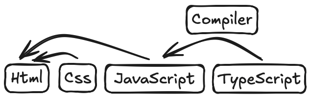

# TypeScript

Este projeto tem como objetivo dar um norte para quem está começando com Typescript

# O que você vai encontrar aqui?

- [Como funciona o Typescript](#como-funciona-o-typescript)
- [Como compilar Typescript para gerar Javascript](#como-compilar-typescript-para-gerar-javascript)
- [Como preparar o ambiente de desenvolvimento para utilizar TypeScript](#como-preparar-o-ambiente-de-desenvolvimento-para-utilizar-typescript)
- [Algumas extensões para ajudar no desenvolvimento com VSCode](#extensões-vs-code)

# Como funciona o Typescript

- Typescript é uma linguagem de programação baseada no Javascript. Ele adiciona algumas funcionalidades que não estáo presentes na versão nativa do Javascript. Resumindo: Typescript é um Javascript com super poderes.
- O Typescript precisa ser compilado para que seja executado nos navegadores (Chrome, Firefox, etc).

> Na imagem abaixo temos uma representação desse processo. Páginas Html, incluem arquivos Css e Javascript. O Typescript é compilado e gerado um arquivo Javascript que é incluído na página web



# Como compilar Typescript para gerar Javascript

- Para compilar podemos utilizar o compiler com o seguinte comando

```shell
tsc index.ts
```

- Também é possível gerar um arquivo chamado tsconfig.json e incluir configurações de compilação para o código Typescript. A referência desse arquivo você encontra [aqui](https://www.typescriptlang.org/tsconfig/)

- Para gerar o arquivo podemos executar o comando

```shell
tsc --init
```

- Com o arquivo gerado também podemos utilizar o comando abaixo para que o código da nossa aplicação seja monitorado e quando houver atualizações ocorra uma nova compilacão de forma automática
- Para isso, adicione ao tsconfig.json as configurações

```json
{
  "compilerOptions": {
    // ...
    "rootDir": "./src",             /* Especifica o diretório que contém os códigos Typescript */
    "outDir": "./dist",             /* Especifica o diretório na qual os arquivos compilados serão criados */
    // ...
  }
}

- Para que seja compilado automaticamente, execute o comando

```shell
tsc --watch
```

```

# Como preparar o ambiente de desenvolvimento para utilizar Typescript

- Para iniciar o desenvolvimento o primeiro passo é instalar o typescript e para fazer isso você precisará ter instalado o nodejs

# Instalação no Mac OS

- [Instalar o gerenciador de pacotes para o Mac OS](https://brew.sh)
- [Instalar o nodejs](https://formulae.brew.sh/formula/node#default)

```shell
brew install node
```

- [Instalar o TypeScript usando o gerenciador de pacores npm](https://www.typescriptlang.org/download/)

```shell
npm install typescript 
```

# Extensões VS Code

- [ESLint](https://marketplace.visualstudio.com/items?itemName=dbaeumer.vscode-eslint)
- [Material Icon Theme](https://marketplace.visualstudio.com/items?itemName=PKief.material-icon-theme)
- [Prettier - Code formatter](https://marketplace.visualstudio.com/items?itemName=esbenp.prettier-vscode)
- [Live Server](https://marketplace.visualstudio.com/items?itemName=ritwickdey.LiveServer)